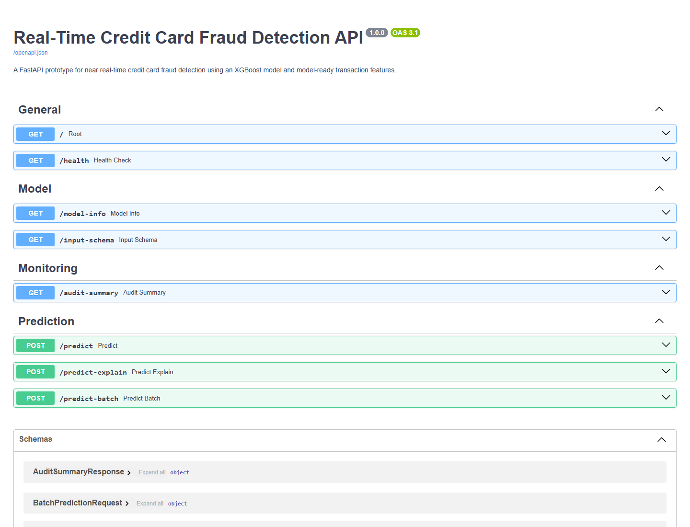
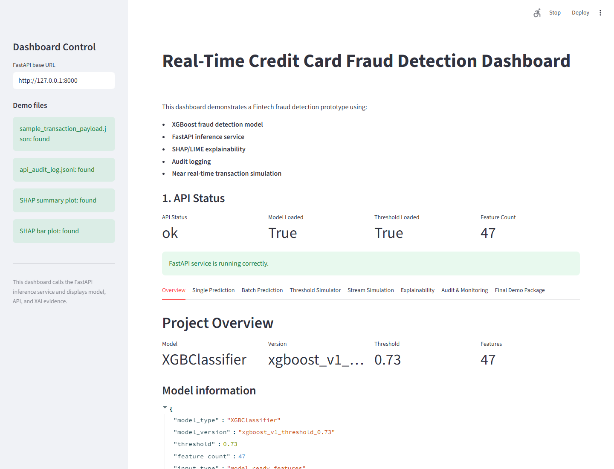
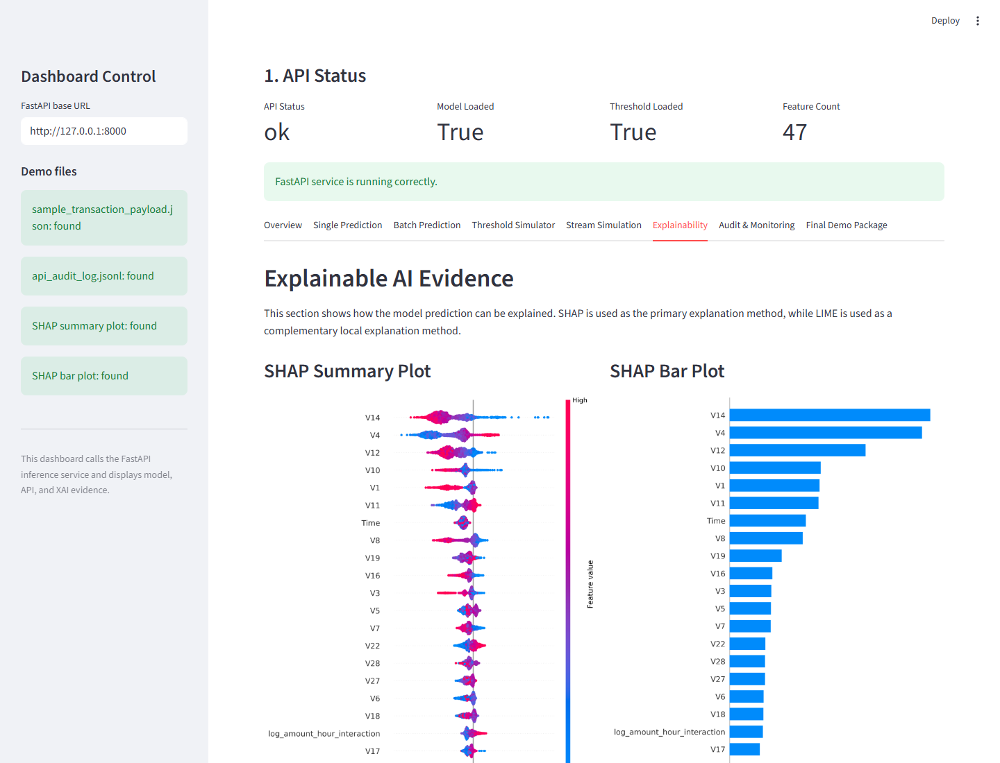
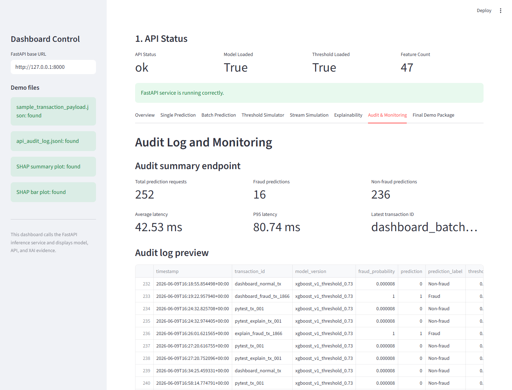

# Real-Time Credit Card Fraud Detection with Explainable AI

This repository contains an end-to-end Fintech fraud detection prototype using
XGBoost, explainable AI, FastAPI, and Streamlit.

The project demonstrates model training, threshold tuning, SHAP/LIME
explainability, reusable inference packaging, API prediction, audit logging,
latency testing, stream simulation, and dashboard visualization.

## Key Features

- Credit card fraud detection with XGBoost
- Evaluation for severe class imbalance
- Decision threshold tuning
- SHAP and LIME explainability
- Reusable inference pipeline
- FastAPI service for single, batch, and explainable prediction
- Audit log and audit summary endpoint
- API latency testing
- Mixed stream simulation
- Streamlit dashboard for final demonstration

## Repository Structure

```text
api/                  FastAPI application
dashboard/            Streamlit dashboard
src/                  Reusable ML and inference code
notebooks/            EDA, feature engineering, modeling, explainability
tests/                API and manual test scripts
reports/              Metrics, plots, API responses, screenshots, notes
data/                 Data instructions and small sample data only
models/               Local model artifacts, not committed by default
```

More detail: [`PROJECT_STRUCTURE.md`](PROJECT_STRUCTURE.md)

## Dataset

This project uses the Credit Card Fraud Detection dataset from Kaggle.

The full raw dataset is not included in this repository. Download it from
Kaggle and place it at:

```text
data/raw/creditcard.csv
```

See [`data/README.md`](data/README.md) and
[`reports/data_card.md`](reports/data_card.md).

## Model Summary

Final model:

```text
XGBoost Classifier
```

Selected decision threshold:

```text
0.73
```

Test-set performance:

| Metric | Value |
|---|---:|
| ROC-AUC | 0.9815 |
| PR-AUC | 0.7892 |
| Fraud Precision | 0.8889 |
| Fraud Recall | 0.7467 |
| Fraud F1-score | 0.8116 |

Confusion matrix:

| Result | Count |
|---|---:|
| True Negative | 56880 |
| False Positive | 7 |
| False Negative | 19 |
| True Positive | 56 |

See [`reports/model_card.md`](reports/model_card.md).

## Installation

Create the Conda environment:

```bash
conda env create -f environment.yml
conda activate fraud-xai
```

Or install dependencies with pip:

```bash
pip install -r requirements.txt
```

## Quick Start

See [`QUICK_START.md`](QUICK_START.md).

## Run FastAPI

```bash
conda activate fraud-xai
uvicorn api.main:app --reload --host 127.0.0.1 --port 8000
```

Open Swagger UI:

```text
http://127.0.0.1:8000/docs
```

Main endpoints:

| Endpoint | Method | Description |
|---|---|---|
| `/` | GET | Root endpoint |
| `/health` | GET | API and artifact status |
| `/model-info` | GET | Model metadata |
| `/input-schema` | GET | Required input features |
| `/audit-summary` | GET | Audit log summary |
| `/predict` | POST | Predict one transaction |
| `/predict-explain` | POST | Predict and return top feature explanations |
| `/predict-batch` | POST | Predict multiple transactions |

## Run Streamlit Dashboard

Open a second terminal:

```bash
conda activate fraud-xai
streamlit run dashboard/app.py
```

Dashboard URL:

```text
http://localhost:8501
```

Main dashboard entrypoint:

```text
dashboard/app.py
```

## Run Tests

```bash
conda activate fraud-xai
pytest tests/test_api.py
```

Manual checks:

```bash
python tests/manual_predict_with_sample_payload.py
python tests/manual_predict_batch_with_sample.py
python tests/manual_bad_request_test.py
python tests/api_latency_test.py
python tests/api_stream_simulation.py
```

## Demo Screenshots

Screenshots are stored in `reports/screenshots/`.

### FastAPI Swagger UI



### Dashboard Overview



### Explainability Evidence



### Audit Monitoring



## Important Reports

- [`reports/model_card.md`](reports/model_card.md)
- [`reports/data_card.md`](reports/data_card.md)
- [`reports/final_demo_script.md`](reports/final_demo_script.md)
- [`reports/final_project_checklist.md`](reports/final_project_checklist.md)
- [`reports/final_evidence_inventory.csv`](reports/final_evidence_inventory.csv)
- [`reports/week7_predict_success_response.json`](reports/week7_predict_success_response.json)
- [`reports/week7_predict_batch_success_response.json`](reports/week7_predict_batch_success_response.json)
- [`reports/week8_predict_explain_response.json`](reports/week8_predict_explain_response.json)
- [`reports/week7_api_latency_summary.csv`](reports/week7_api_latency_summary.csv)
- [`reports/week7_api_stream_simulation.csv`](reports/week7_api_stream_simulation.csv)

## Artifact Policy

The repository does not commit:

- full raw dataset files,
- processed train/test datasets,
- model `.pkl` artifacts,
- runtime audit logs,
- local credentials or secrets.

These files are generated locally or downloaded separately.

## Limitations

- The API currently receives model-ready features, not raw transaction data.
- PCA features cannot be directly interpreted as business variables.
- The Kaggle dataset does not include customer ID, merchant ID, device ID, or
  location.
- Real-time deployment is simulated at prototype level.
- False negatives still exist and require monitoring and analyst review.

## Future Work

- Add a feature store or real-time feature engineering layer.
- Add data drift and model drift monitoring.
- Add fraud analyst feedback loop.
- Add model retraining pipeline.
- Deploy the API using Docker or a cloud service.
